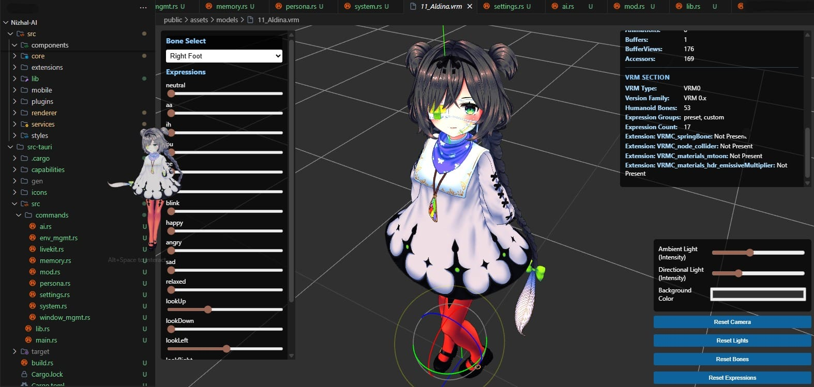

<div align="center">

  

  # 👻 Nizhal AI
  
  ### **Your Intelligent Desktop Screen Mate**
  
  **"More than just an assistant. A friend who lives right on your desktop, understands your emotions, and grows with you every day
-now faster and lighter than ever."**

  [](https://tauri.app)
  []()
  [](https://tauri.app)
  [](https://rust-lang.org)
  [](https://github.com/John-Varghese-EH/Nizhal-AI)

  <br/>

  [🚀 **Download Now**](https://github.com/John-Varghese-EH/Nizhal-AI/releases/latest) •
  [📖 **Wiki/Docs**](#) •
  [💬 **Join Discord**](#) •
  [🐛 **Report Issues**](https://github.com/John-Varghese-EH/Nizhal-AI/issues)

</div>

---

<div align="center">
  
  <p style="font-size: 1.1em; color: #666; margin-top: 15px;">
    Powered by Tauri & Rust for native-level performance and minimal hardware footprint.
  </p>
</div>

---
> [!TIP]
> **What's New?** 
> Nizhal AI has been completely rewritten from Electron to **Tauri v2** using **Rust**! This means insanely fast startup times, highly optimized CPU/RAM usage (running effortlessly on low-end hardware), and sweeping new **Cross-Platform** magic across Windows, Linux, and macOS.
---
> [!NOTE]
> **🚧 Work in Progress:**  
> This project is actively being developed! Contributions, feedback, and ideas are welcome.  
> *Star the repo and join the project!*
---

## 🌟 **Why Choose Nizhal AI?**

**Nizhal** (നിഴൽ) means **"Shadow"** in Malayalam. Just like a shadow, this AI companion seamlessly lives natively on your system. With our highly optimized, borderless WebGL overlay, your 3D avatar actually physically interacts with your active desktop windows, drastically using fewer resources than the average browser tab.

<div align="center">

  <table style="border: none; width: 100%;">
    <tr>
      <td align="center" style="padding: 20px; background: linear-gradient(135deg, #FF512F 0%, #DD2476 100%); border-radius: 15px; color: white; margin: 10px;">
        <h3>🦀 Ultra-Lightweight Rust</h3>
        <p>Built on Tauri v2. Near-zero RAM footprint compared to Electron. Highly optimized to preserve your battery and CPU.</p>
        <div style="font-size: 2em;">🚀</div>
      </td>
      <td align="center" style="padding: 20px; background: linear-gradient(135deg, #667eea 0%, #764ba2 100%); border-radius: 15px; color: white; margin: 10px;">
        <h3>🍎🐧 Cross-Platform Native</h3>
        <p>Proper first-class support for Windows, macOS, and Linux (X11/Wayland) with OS-specific native features, also have partial support for Android, ChromeOS and iOS.</p>
        <div style="font-size: 2em;">🌍</div>
      </td>
      <td align="center" style="padding: 20px; background: linear-gradient(135deg, #4facfe 0%, #00f2fe 100%); border-radius: 15px; color: white; margin: 10px;">
        <h3>🔒 Complete Privacy</h3>
        <p>Runs 100% locally with Ollama. Your data stays on your device safely.</p>
        <div style="font-size: 2em;">🛡️</div>
      </td>
    </tr>
  </table>

</div>

---

## 📸 **Visual Journey**

<div align="center">

  <h3 style="color: #667eea; margin-bottom: 20px;">✨ Main Experience</h3>
  
  | 💬 Chat Interface | 🏃 Desktop Screen Mate | ⚙️ Settings |
  |:---:|:---:|:---:|
  |  |  |  |
  | *🤖 Talk with your AI friend* | *🕹️ Interacts with native windows* | *🎨 Customize everything* |

</div>

---

## 🚀 Key Features

<table>
  <tr>
    <td width="50%">

### 🗣️ Natural Voice Interaction
- Talk naturally with **no wake words**
- Real-time voice with **LiveKit** & **WebSpeech**
- Multilingual support (English, Hindi, Malayalam)
- Voice commands for desktop control

### 🧠 Emotional Intelligence
- **Camera emotion detection** (happy, sad, focused)
- Sentiment analysis from conversations
- Avatar mirrors your emotions in real-time
- 14+ emotion states for expressive responses

### 🔮 Live 3D Avatars & Desktop Collision
- Beautiful **VRM model** support overlaid directly on your monitor! (No window borders)
- Native Win32 backend tracks your active Chrome/VS Code tabs.
- The Avatar uses raycasting to know when to let your mouse "click-through" vs interact!
- Drag & drop your own characters

    </td>
    <td width="50%">

### 🌍 Life Management
- **Weather** with customizable location
- **Calendar** sync with Google Calendar
- **Mood Tracker** with weekly visualization
- **Habit Tracker** with streaks
- **Smart Reminders** with natural language

### 📱 Device Control
- **Android control** via ADB
- Screen mirroring with scrcpy
- Desktop automation (apps, volume, files)
- Cross-device command center

### 🤖 AI Flexibility
- **Local LLMs**: Ollama (100% private)
- **Cloud**: Gemini, OpenAI, Anthropic
- **Voice**: ElevenLabs, Edge TTS
- Automatic fallback between providers

    </td>
  </tr>
</table>

---

## 🌟 **What makes the Rust based Nizhal-AI Screen Mate special?**

We've supercharged Nizhal AI with cutting-edge capabilities that make it the most comprehensive desktop companion available!

> [!IMPORTANT]  
> **Unrestricted Interactivity**
> The character is no longer trapped in a dragging window. The WebGL Canvas takes over your entire screen securely as a click-through transparent layer. 

### ⚙️ **Under the Hood (Tauri + Rust API)**
- **Ultra-Lightweight**: Memory usage is slashed to the absolute minimum! Runs smoothly in the background taking vastly fewer resources than traditional web-wrapper apps.
- **Native OS Interactions**: 
  - 🪟 **Windows**: Dynamic Win32 polling maps your active tabs gracefully to the avatar's internal collision boundaries.
  - 🍎 **macOS**: Beautiful native translucency and smooth Spaces integration.
  - 🐧 **Linux**: First-class support for both X11 and Wayland compositors with optimized WebView overlays.
- **Raycasted Interaction**: Hover over the character to interact (`Alt_Click`), otherwise, normal desktop workflows continue unobstructed!
- **Resource Optimized**: Automatically throttles 3D WebGL rendering intervals depending on if you are playing games or working heavily.

---

## 🆚 Comparison

| Feature | Nizhal AI (Tauri + Rust) | Traditional Companions |
|:---|:---:|:---:|
| **Architecture** | ✅ Native Rust & React | ❌ Heavy Web Wrappers |
| **Cross-Platform** | ✅ Linux, Mac, Win Support | ⚠️ Windows-centric usually |
| **Resource Usage** | ✅ Ultra-Light (`< 50MB` UI) | ❌ Heavy >500MB |
| **Privacy** | ✅ 100% Local Options | ❌ Cloud-only |
| **Customization** | ✅ Drop any `.vrm` | ❌ Limited Skins |

---

## ⚡ Quick Start

### 📥 1. Download (Recommended)
Download the optimized Windows installer from the [Releases Page](https://github.com/John-Varghese-EH/Nizhal-AI/releases/latest).

### 🔧 2. Developer Setup
<details>
<summary><b>View Build Instructions</b></summary>

```bash
# Clone the repository
git clone https://github.com/John-Varghese-EH/Nizhal-AI.git
cd Nizhal-AI

# Install frontend dependencies (Node.js v20+ required)
npm install

# Start development mode (Tauri will automatically compile Rust backend)
npm run tauri:dev

# Full setup with LiveKit agent
npm run setup

```

</details>

---

## 🛠️ Tech Stack & Structure

<details>
<summary><b>View Technical Details</b></summary>

### 🏗️ **Modular Design**
- **Microservices Architecture**: Rust Native backend safely detached from React frontend.
- **Tauri IPC Bridge**: High-performance messaging between OS and React UI.
- **Real-Time Communication**: WebSocket and LiveKit integration.

### 🔧 **Core Technologies**
- **Frontend**: React 18, Vite, TailwindCSS, Framer Motion
- **Desktop System**: Tauri v2, Rust `winapi`
- **3D Engine**: Three.js, React Three Fiber, `@pixiv/three-vrm`
- **AI**: Ollama, Google Gemini, OpenAI, Anthropic

### Directory Structure

```text
Nizhal-AI/
├── src-tauri/         # 🦀 Rust Backend (Replaces main/)
│   ├── src/commands/  # Native OS bridging & Window Management
│   └── Cargo.toml     # Rust dependencies list
├── src/               
│   ├── renderer/      # React UI, R3F VRM canvas, and styling
│   ├── services/      # State Controllers & Physics logic
│   └── hooks/         # Custom React integrations
└── platform/          # Prebuilt assets and config tools
```

</details>

---

## ❓ FAQ

<details>
<summary><b>Is my data private?</b></summary>
Yes! When using local LLMs (Ollama), all your data stays on your machine.
</details>

<details>
<summary><b>Can I use my own AI models?</b></summary>
Absolutely! Install Ollama and pull any model (Llama 3, Mistral, etc.). Configure the model in Settings → AI Providers.
</details>

<details>
<summary><b>How do I change the avatar?</b></summary>
Simply drag and drop any `.vrm` file onto the character or use the settings menu.
</details>

<details>
<summary><b>Does it work offline?</b></summary>
Yes, with Ollama running locally. Voice commands work with WebSpeech API (browser-based, requires internet for some features).
</details>

<details>
<summary><b>What's the performance impact?</b></summary>
Minimal! By porting to Tauri and Rust and prioritizing efficiency, memory usage has dropped drastically. 3D rendering uses a highly optimized WebGL context.
</details>

---

<div align="center">
<p>Made with ❤️ in Kerala(India) by <b>John Varghese</b></p>
<p>⭐ <b>Star this repo if Nizhal-AI made you smile!</b> ⭐</p>
</div>